# ☁️ Vendor Payments Cloud Data Platform


---

## 📌 Summary

This project extends the Vendor Payments data engineering portfolio into an AWS cloud analytics platform.

It publishes validated outputs from both batch and streaming pipelines into an Amazon S3 data lake and enables serverless analytics through Amazon Athena.

```text
Batch ETL Outputs
→ Airflow Validation
→ S3 Batch Zones
→ Athena Batch Tables
→ Batch Analytics

Kafka Streaming Outputs
→ Airflow Downstream Validation
→ Streaming Curated CSV
→ S3 Streaming Zones
→ Athena Streaming Table
→ Streaming Analytics
```

The project focuses on organizing trusted outputs in cloud storage and making them queryable without introducing a separate warehouse layer.

---

## 🧭 Role in the Data Platform

This repository is part of a connected Vendor Payments data engineering portfolio.

| Layer                 | Repository                              | Responsibility                                                              |
| --------------------- | --------------------------------------- | --------------------------------------------------------------------------- |
| Batch ETL             | `vendor-payments-etl-analytics`         | Validate, clean, transform, and build Silver and Gold outputs               |
| Kafka Streaming       | `vendor-payments-streaming-pipeline`    | Produce, consume, validate, deduplicate, and write streaming staging events |
| Airflow Orchestration | `vendor-payments-airflow-orchestration` | Run the batch pipeline and validate batch and streaming outputs             |
| Cloud Platform        | `vendor-payments-cloud-data-platform`   | Publish trusted outputs to S3 and query them with Athena                    |

---

## 🏗️ Architecture

The cloud platform contains two separate flows because the batch and streaming pipelines use different processing and validation steps.

### Batch Cloud Data Flow

```text
Batch ETL Pipeline
↔ Airflow Orchestration
→ Cloud Publishing
→ Amazon S3 Data Lake
→ Amazon Athena
→ Analytics Output
```

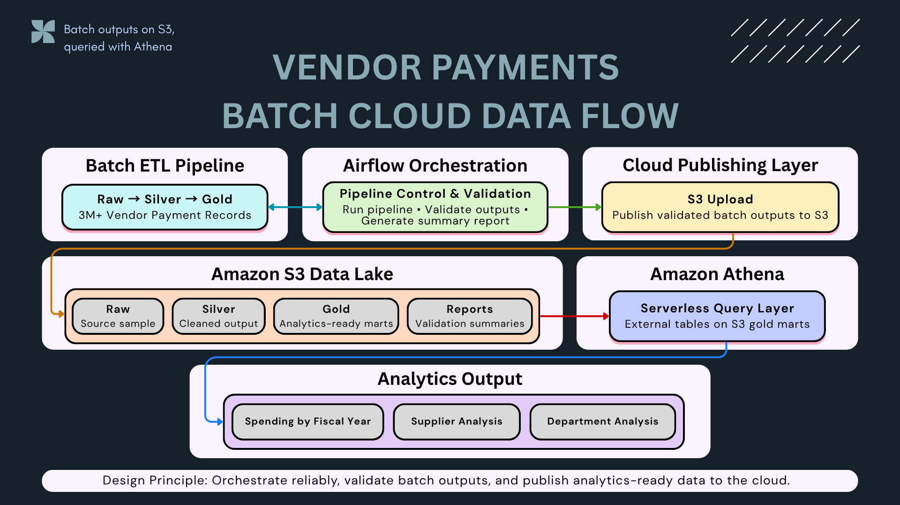

### Streaming Cloud Data Flow

```text
Kafka Streaming Pipeline
→ Airflow Streaming Validation
→ Cloud Publishing
→ Amazon S3 Data Lake
→ Amazon Athena
→ Analytics Output
```

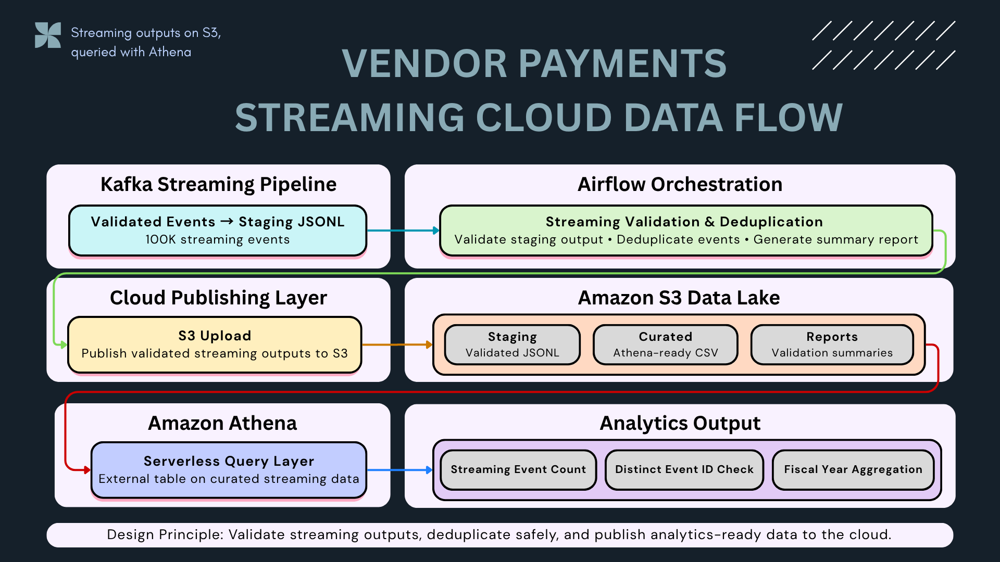

---

# Batch Cloud Layer

## 🪣 Batch S3 Data Lake Layout

Validated batch outputs are organized into separate S3 zones.

```text
s3://vendor-payments-data-platform-thana/data-platform/vendor-payments/
│
├── raw/
│   └── sample/
│       └── vendor_payments_sample.csv
│
├── silver/
│   └── sample/
│       └── vendor_payments_silver_sample.csv
│
├── gold/
│   └── sample/
│       ├── mart_fund_category_summary/
│       ├── mart_pending_by_department/
│       ├── mart_spending_by_department/
│       ├── mart_spending_by_fiscal_year/
│       └── mart_spending_by_supplier_top_n/
│
└── reports/
    └── sample/
        └── data quality and validation reports
```

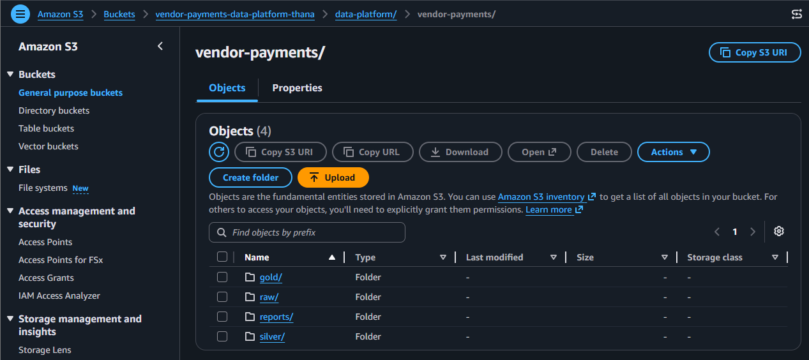

---

## 📦 Batch Gold Marts Uploaded to S3

Gold mart outputs are stored in table-specific folders so that Athena external tables can query each dataset reliably.

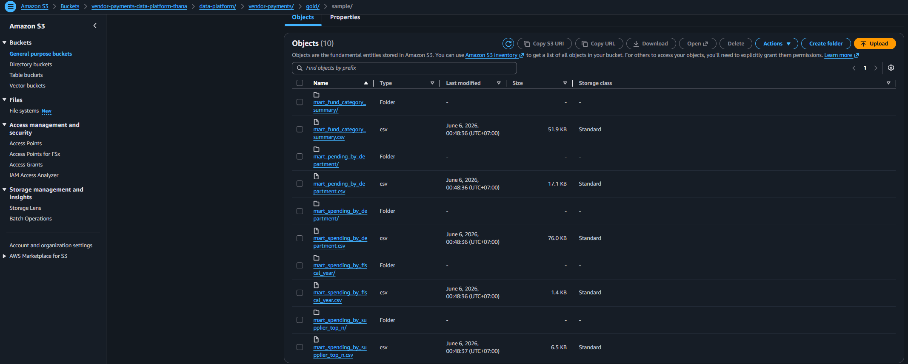

---

## 🔎 Batch Athena Query Layer

Athena is used as a serverless query layer over the S3 Gold zone.

Created database:

```sql
vendor_payments_analytics
```

Created batch external tables:

```text
mart_spending_by_fiscal_year
mart_spending_by_supplier_top_n
mart_pending_by_department
```

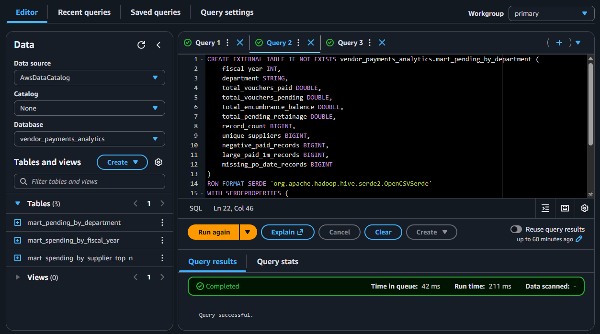

Example query:

```sql
SELECT
    fiscal_year,
    total_vouchers_paid,
    total_vouchers_pending,
    record_count,
    unique_suppliers
FROM vendor_payments_analytics.mart_spending_by_fiscal_year
ORDER BY fiscal_year;
```


This confirms that analytics-ready Gold marts stored in S3 can be queried successfully through Athena.

---

# Streaming Cloud Layer

## 🌊 Streaming Curated Output

The Kafka consumer writes validated events to a local JSONL staging file.

The cloud project converts the JSONL staging output into a flattened CSV file before publishing it to the curated S3 zone.

```text
Kafka staging JSONL
→ Flatten nested records
→ Curated streaming CSV
→ S3 streaming/curated/
→ Athena external table
```

Converter:

```text
scripts/streaming/convert_streaming_jsonl_to_csv.py
```

Generated output:

```text
data/streaming/curated/vendor_payments_streaming_events.csv
```

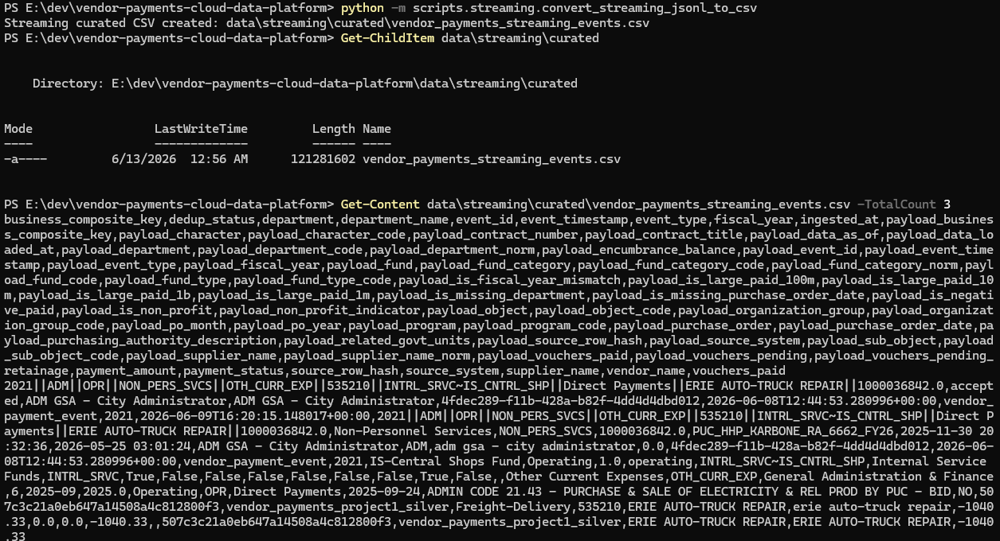

Generated data files are kept out of Git and published directly to S3.

---

## 🪣 Streaming S3 Data Lake Layout

Streaming outputs are organized separately from batch zones.

```text
s3://vendor-payments-data-platform-thana/data-platform/vendor-payments/streaming/
│
├── staging/
│   └── vendor_payments_streaming_staging.jsonl
│
├── curated/
│   └── vendor_payments_streaming_events.csv
│
└── reports/
    ├── streaming_summary_report.json
    └── airflow_orchestration_summary.json
```

The zones have separate responsibilities:

| Zone       | Purpose                                         |
| ---------- | ----------------------------------------------- |
| `staging/` | Validated Kafka consumer output in JSONL format |
| `curated/` | Flattened Athena-ready CSV                      |
| `reports/` | Streaming and orchestration summary reports     |

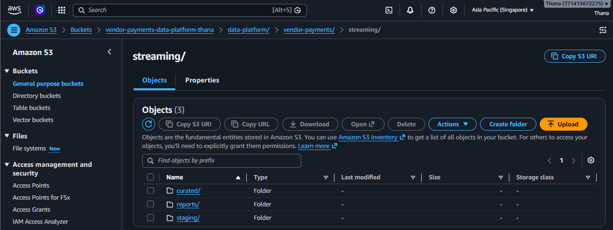

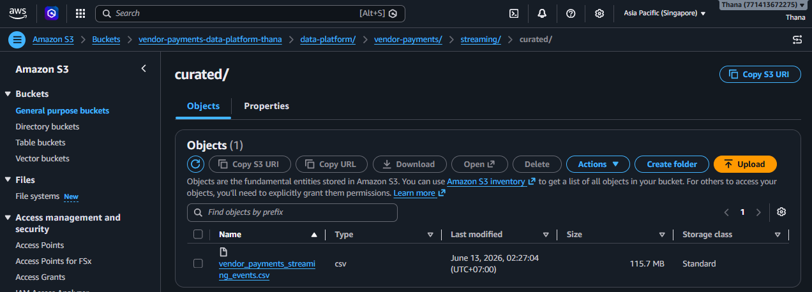

---

## 🔎 Streaming Athena Query Layer

A dedicated Athena external table queries the curated streaming CSV.

Created table:

```text
vendor_payments_streaming_events
```

Table definition:

```text
sql/athena/06_create_streaming_events_table.sql
```

Example query:

```sql
SELECT
    event_id,
    event_timestamp,
    event_type,
    fiscal_year,
    department_name,
    supplier_name,
    CAST(payment_amount AS DOUBLE) AS payment_amount
FROM vendor_payments_analytics.vendor_payments_streaming_events
LIMIT 10;
```

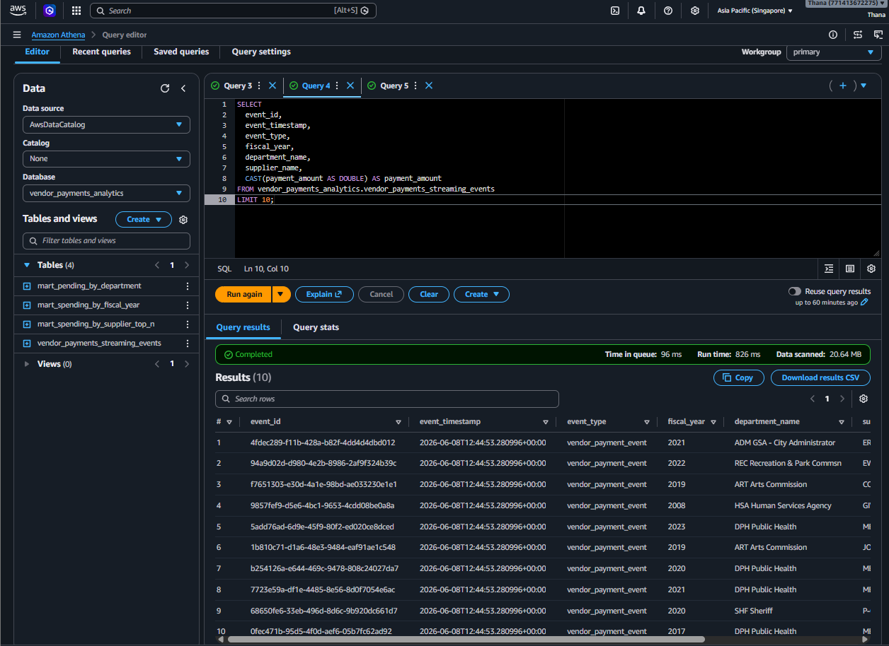

---

## 🔁 Streaming Event Validation

The curated streaming table contains 100,000 accepted events.

```sql
SELECT
    COUNT(*) AS total_streaming_events,
    COUNT(DISTINCT event_id) AS unique_event_ids
FROM vendor_payments_analytics.vendor_payments_streaming_events;
```

Result:

```text
total_streaming_events = 100000
unique_event_ids       = 100000
```

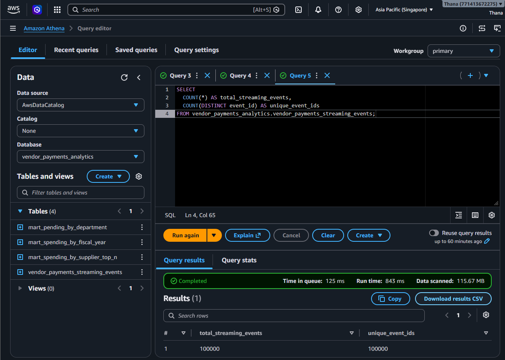

This confirms that the accepted streaming dataset remains unique by `event_id` after validation, cloud publishing, and Athena querying.

---

## 📊 Streaming Fiscal Year Analytics

Example aggregation:

```sql
SELECT
    fiscal_year,
    COUNT(*) AS event_count,
    SUM(CAST(payment_amount AS DOUBLE)) AS total_payment_amount
FROM vendor_payments_analytics.vendor_payments_streaming_events
GROUP BY fiscal_year
ORDER BY fiscal_year;
```

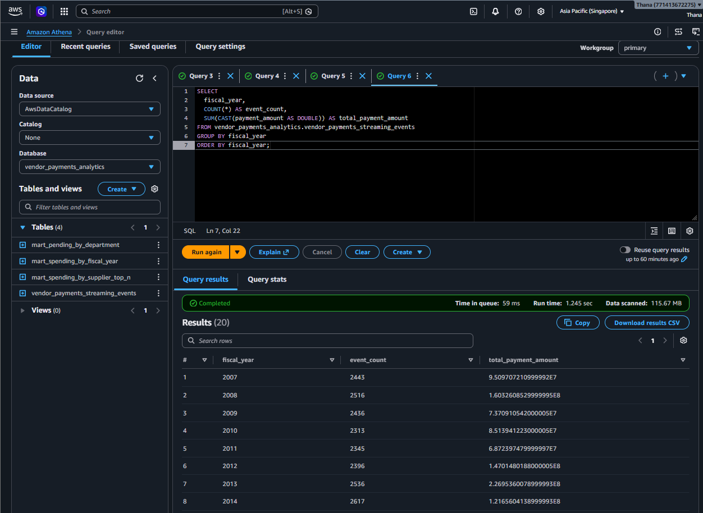

---

# ⚙️ Upload Workflows

## Batch Upload

Script:

```text
scripts/batch/upload_to_s3.py
```

Uploads:

```text
Raw sample
Silver sample
Gold mart CSV files
Validation reports
```

Run:

```bash
python -m scripts.batch.upload_to_s3
```

---

## Streaming Conversion

Script:

```text
scripts/streaming/convert_streaming_jsonl_to_csv.py
```

Run:

```bash
python -m scripts.streaming.convert_streaming_jsonl_to_csv
```

---

## Streaming Upload

Script:

```text
scripts/streaming/upload_streaming_to_s3.py
```

Uploads:

```text
Streaming staging JSONL
Streaming curated CSV
Streaming summary report
Airflow orchestration summary
```

Run:

```bash
python -m scripts.streaming.upload_streaming_to_s3
```

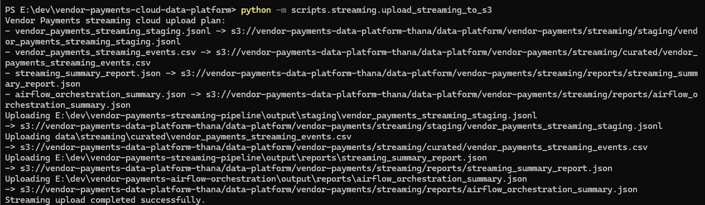

---

## 🔧 Environment Variables

AWS credentials are handled through an AWS CLI profile or the standard AWS credential chain.

Example configuration:

```env
AWS_PROFILE=default
AWS_REGION=ap-southeast-1

S3_BUCKET=your-s3-bucket-name
S3_PREFIX=data-platform/vendor-payments

PROJECT1_ROOT=E:\dev\vendor-payments-etl-analytics
PROJECT3_ROOT=E:\dev\vendor-payments-streaming-pipeline
PROJECT4_OUTPUT_ROOT=E:\dev\vendor-payments-airflow-orchestration\output
```

Do not commit real AWS credentials.

---

# 🧪 Testing and CI

The project includes automated tests for:

* Required project directories and files
* Batch S3 upload plan generation
* Streaming S3 upload plan generation
* Local file validation before upload
* S3 key and zone structure
* JSONL parsing and validation
* Nested JSON record flattening
* JSONL-to-CSV conversion
* Athena SQL file existence
* Batch Athena table definitions
* Streaming Athena table definition
* Streaming analytics query references

Run locally:

```bash
python -m ruff check .
python -m pytest -v
```

Current local result:

```text
Ruff: all checks passed
Pytest: 25 passed
```

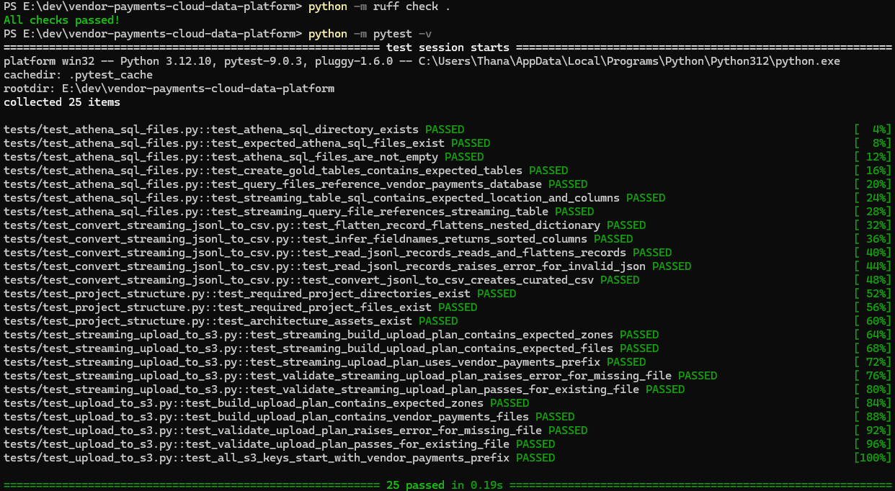

GitHub Actions runs Ruff and Pytest on every push.

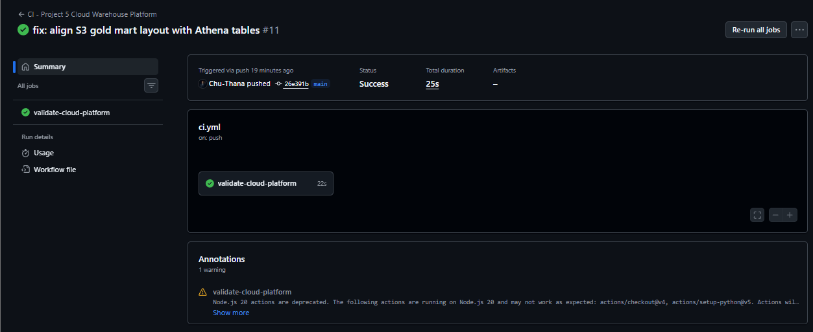

The CI workflow validates code, tests, SQL assets, and project structure without requiring AWS credentials.

---

# 📁 Repository Structure

```text
vendor-payments-cloud-data-platform/
│
├── scripts/
│   ├── batch/
│   │   ├── convert_to_parquet.py
│   │   ├── upload_csv_to_s3.py
│   │   └── upload_to_s3.py
│   │
│   └── streaming/
│       ├── convert_streaming_jsonl_to_csv.py
│       └── upload_streaming_to_s3.py
│
├── sql/
│   └── athena/
│       ├── 01_create_database.sql
│       ├── 02_create_gold_tables.sql
│       ├── 03_query_spending_by_fiscal_year.sql
│       ├── 04_query_top_suppliers.sql
│       ├── 05_query_pending_by_department.sql
│       ├── 06_create_streaming_events_table.sql
│       └── 07_query_streaming_events.sql
│
├── tests/
│   ├── test_athena_sql_files.py
│   ├── test_convert_streaming_jsonl_to_csv.py
│   ├── test_project_structure.py
│   ├── test_streaming_upload_to_s3.py
│   └── test_upload_to_s3.py
│
├── assets/
│   └── vendor-payments-cloud/
│       ├── batch/
│       └── streaming/
│
├── data/
│   └── streaming/
│       └── curated/
│
├── .github/
│   └── workflows/
│       └── ci.yml
│
├── .env.example
├── .gitignore
├── requirements.txt
└── README.md
```

---

# 🔐 Cloud Design Notes

## Credentials

AWS credentials are never hardcoded in the repository.

Configuration is handled through:

* AWS CLI profiles
* Environment variables
* Standard boto3 credential resolution
* `.env.example` for documentation only

## Generated Outputs

The streaming curated CSV is a generated file and is not committed to Git.

It is created locally and uploaded directly to S3.

## CI Boundaries

GitHub Actions does not upload files to AWS.

CI validates:

* Python code quality
* Upload plan logic
* Conversion logic
* SQL assets
* Project structure
* Automated tests

This keeps cloud credentials outside the CI workflow.

---

# 🧠 What This Project Demonstrates

* AWS S3 layered data lake design
* Separate batch and streaming cloud zones
* Python and boto3 upload automation
* JSONL-to-CSV streaming curation
* Athena external tables over S3
* Batch Gold mart analytics
* Streaming event analytics
* Event uniqueness validation
* Environment-based configuration
* Automated tests with Pytest
* Code quality validation with Ruff
* GitHub Actions CI
* Separation between ETL, streaming, orchestration, and cloud analytics responsibilities

---

# ✅ Current Status

| Component                                 | Status      |
| ----------------------------------------- | ----------- |
| Batch raw sample uploaded                 | ✅ Done      |
| Batch Silver sample uploaded              | ✅ Done      |
| Batch Gold marts uploaded                 | ✅ Done      |
| Batch reports uploaded                    | ✅ Done      |
| Batch Athena tables created               | ✅ Done      |
| Batch Athena queries successful           | ✅ Done      |
| Streaming staging JSONL validated         | ✅ Done      |
| Streaming curated CSV generated           | ✅ Done      |
| Streaming zones uploaded to S3            | ✅ Done      |
| Streaming Athena table created            | ✅ Done      |
| Streaming event count query successful    | ✅ Done      |
| Streaming fiscal year query successful    | ✅ Done      |
| 100,000 unique streaming events confirmed | ✅ Done      |
| Ruff code quality                         | ✅ Passed    |
| Pytest validation                         | ✅ 25 passed |
| GitHub Actions CI                         | ✅ Passed    |

---

# 💡 Key Takeaway

A data pipeline should not stop after producing local files.

This project extends validated batch and streaming outputs into a cloud analytics layer:

```text
Batch ETL
→ Airflow validation
→ S3 batch zones
→ Athena batch analytics

Kafka streaming
→ Airflow downstream validation
→ Curated streaming data
→ S3 streaming zones
→ Athena streaming analytics
```

The central design principle is:

```text
Orchestrate reliably,
validate outputs,
publish trusted data to the cloud,
and make it queryable through a serverless analytics layer.
```
