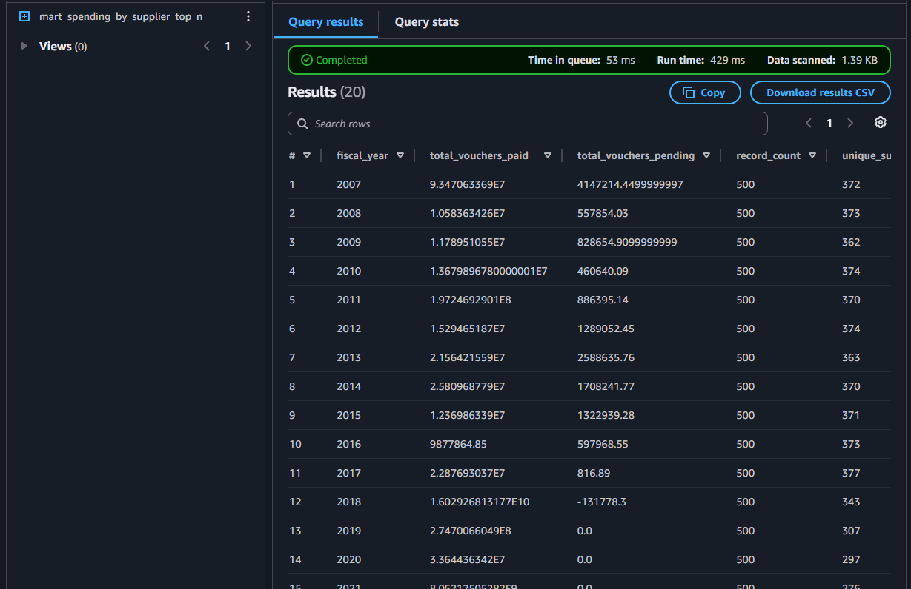

# ☁️ Vendor Payments Cloud Data Platform


---

## 📌 Summary

This project extends the **Vendor Payments batch ETL pipeline** into an AWS cloud data platform.

The platform publishes validated outputs from the ETL pipeline into an S3-based data lake and enables serverless analytics using Amazon Athena.

```text
Vendor Payments ETL Outputs
→ S3 Data Lake
→ Raw / Silver / Gold / Reports Zones
→ Athena External Tables
→ SQL Analytics over Gold Marts
```

This project focuses on the cloud analytics layer of the batch data pipeline.

---

## 🧭 Role in the Data Platform

This repository is part of a larger production-style data engineering portfolio.

| Layer | Repository | Responsibility |
|---|---|---|
| Batch ETL | `vendor-payments-etl-analytics` | Clean, validate, transform, and build silver/gold outputs |
| Orchestration | `vendor-payments-airflow-orchestration` | Orchestrate the Vendor Payments ETL pipeline with Airflow |
| Cloud Platform | `vendor-payments-cloud-data-platform` | Upload ETL outputs to S3 and query gold marts with Athena |

---

## 🏗️ Architecture

```text
Project 1: Vendor Payments ETL
raw CSV
→ data readiness checks
→ silver transformation
→ gold marts
→ validation reports

Project 5: Cloud Data Platform
local ETL outputs
→ S3 raw zone
→ S3 silver zone
→ S3 gold zone
→ S3 reports zone
→ Athena external tables
→ SQL analytics
```

---

## 🪣 S3 Data Lake Layout

The S3 data lake is organized into clear zones:

```text
s3://vendor-payments-data-platform-thana/data-platform/vendor-payments/
│
├── raw/
│   └── sample/
│       └── vendor_payments_sample.csv
│
├── silver/
│   └── sample/
│       └── vendor_payments_silver_sample.csv
│
├── gold/
│   └── sample/
│       ├── mart_fund_category_summary/
│       ├── mart_pending_by_department/
│       ├── mart_spending_by_department/
│       ├── mart_spending_by_fiscal_year/
│       └── mart_spending_by_supplier_top_n/
│
└── reports/
    └── sample/
        └── data quality and validation reports
```


---

## 📦 Gold Marts Uploaded to S3

Gold mart outputs are uploaded into table-specific folders so that Athena external tables can query them reliably.


---

## 🔎 Athena Query Layer

Athena is used as a serverless query layer over S3 gold marts.

Created Athena database:

```sql
vendor_payments_analytics
```

Created external tables:

```text
mart_spending_by_fiscal_year
mart_spending_by_supplier_top_n
mart_pending_by_department
```


---

## 📊 Athena Query Result

Example query:

```sql
SELECT
    fiscal_year,
    total_vouchers_paid,
    total_vouchers_pending,
    record_count,
    unique_suppliers
FROM vendor_payments_analytics.mart_spending_by_fiscal_year
ORDER BY fiscal_year;
```

Result:



This confirms that the S3 gold mart can be queried successfully through Athena.

---

## ⚙️ Upload Workflow

The upload script reads sample outputs from the local Vendor Payments ETL project and uploads them to S3.

```text
scripts/batch/upload_to_s3.py
```

The script uploads:

```text
raw sample file
silver sample file
gold mart CSV files
data readiness and validation reports
```

### Environment Variables

```env
AWS_PROFILE=default
AWS_REGION=ap-southeast-1

S3_BUCKET=vendor-payments-data-platform-thana
S3_PREFIX=data-platform/vendor-payments

PROJECT1_ROOT=E:\dev\vendor-payments-etl-analytics
```

### Run Upload

```bash
python scripts/batch/upload_to_s3.py
```

---

## 🧪 Testing & CI

This project includes automated tests for:

- Required project structure
- S3 upload plan generation
- Local file validation before upload
- S3 key structure
- Athena SQL files
- Required Athena tables and query references

Run locally:

```bash
python -m pytest -v
python -m ruff check .
```

GitHub Actions validates the project on every push.


---

## 📁 Repository Structure

```text
vendor-payments-cloud-data-platform/
│
├── scripts/
│   └── batch/
│       └── upload_to_s3.py
│
├── sql/
│   └── athena/
│       ├── 01_create_database.sql
│       ├── 02_create_gold_tables.sql
│       ├── 03_query_spending_by_fiscal_year.sql
│       ├── 04_query_top_suppliers.sql
│       └── 05_query_pending_by_department.sql
│
├── tests/
│   ├── test_project_structure.py
│   ├── test_upload_to_s3.py
│   └── test_athena_sql_files.py
│
├── assets/
│   └── vendor-payments-cloud/
│
├── .github/
│   └── workflows/
│       └── ci.yml
│
├── .env.example
├── requirements.txt
└── README.md
```

---

## 🔐 Cloud Design Notes

This project intentionally keeps AWS credentials out of the repository.

Configuration is handled through:

- AWS CLI profile
- Environment variables
- `.env.example` for documentation only

The CI workflow does not upload to AWS.  
It validates local logic, SQL files, project structure, and code quality without requiring cloud credentials.

---

## 🧠 What This Project Demonstrates

- AWS S3 data lake design
- Raw / silver / gold / reports cloud layout
- Upload automation with Python and boto3
- Athena external table creation
- Serverless SQL analytics over S3
- CI validation for cloud platform code
- Clean separation between ETL, orchestration, and cloud analytics layers

---

## ✅ Current Status

| Component | Status |
|---|---|
| S3 bucket created | ✅ Done |
| Raw sample uploaded | ✅ Done |
| Silver sample uploaded | ✅ Done |
| Gold marts uploaded | ✅ Done |
| Reports uploaded | ✅ Done |
| Athena database created | ✅ Done |
| Athena external tables created | ✅ Done |
| Athena query successful | ✅ Done |
| Pytest validation | ✅ Passed |
| Ruff code quality | ✅ Passed |
| GitHub Actions CI | ✅ Passed |

---

## 💡 Key Takeaway

This project shows how batch ETL outputs can be published into a cloud data lake and queried using a serverless analytics layer.

It completes the batch pipeline story:

```text
Validated ETL
→ Airflow orchestration
→ S3 cloud data lake
→ Athena analytics
```
