# ☁️ Vendor Payments Cloud Data Platform


AWS cloud and warehouse layer for the Vendor Payments data platform.

This project publishes trusted Batch and Streaming outputs to Amazon S3, exposes serverless query access through Amazon Athena, loads validated datasets into Amazon Redshift Serverless, creates analytics views, and generates machine-readable warehouse execution metadata.

---

## 📌 Project Summary

The project demonstrates how validated Batch and Streaming outputs can be organized into a cloud data lake and extended into a serverless analytics warehouse.

The Cloud Data Platform is responsible for:

* Publishing trusted Batch outputs to Amazon S3
* Converting validated Streaming JSONL events into curated CSV
* Organizing Batch and Streaming data into separate S3 zones
* Creating Amazon Athena external tables over S3
* Loading Batch and Streaming datasets into Amazon Redshift Serverless
* Creating landing tables and analytics views
* Validating event-ID completeness and uniqueness
* Generating Redshift runtime metadata
* Enforcing a metadata contract before writing the execution artifact
* Providing automated tests, Ruff validation, and GitHub Actions CI

The core design principle is:

```text
The Cloud Data Platform owns cloud storage,
query access, warehouse processing,
analytics views, and runtime metadata.

Airflow invokes and validates these capabilities
without taking ownership of their implementation.
```

---

## 🧭 Architecture

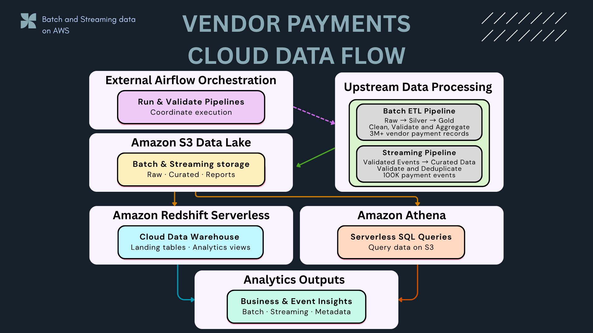

The platform combines two upstream data-processing paths:

* **Batch ETL Pipeline** — produces validated Silver and Gold analytics outputs
* **Streaming Pipeline** — produces validated and deduplicated event data

The cloud layer publishes these outputs to Amazon S3 and provides two analytics paths:

```text
Amazon S3
├── Amazon Athena
│   └── Serverless SQL queries over S3
│
└── Amazon Redshift Serverless
    ├── Landing tables
    └── Analytics views
```

External Airflow orchestration coordinates execution and validates the generated runtime metadata, while this repository retains ownership of Cloud and Warehouse processing.

### Responsibility Boundaries

* **Batch pipeline** owns Raw-to-Silver-to-Gold transformation logic.
* **Streaming pipeline** owns Kafka ingestion, validation, deduplication, and staging output.
* **Cloud platform** owns S3 publishing, Athena definitions, Redshift loading, analytics views, and Redshift runtime metadata.
* **Airflow orchestration** owns execution coordination, dependency validation, and cross-project summary reporting.
* **API serving layer** exposes trusted Batch and Streaming analytics to downstream applications.

---

## 📊 Project Metrics

| Metric                             |    Result |
| ---------------------------------- | --------: |
| Batch Gold marts published         |         5 |
| Redshift Batch landing tables      |         5 |
| Redshift Batch landing rows        |     2,944 |
| Redshift Batch analytics views     |         5 |
| Redshift Streaming landing tables  |         1 |
| Streaming events loaded            |   100,000 |
| Distinct streaming event IDs       |   100,000 |
| Duplicate event IDs                |         0 |
| Missing event IDs                  |         0 |
| Redshift Streaming analytics views |         4 |
| Total Redshift analytics views     |         9 |
| Streaming fiscal-year rows         |        20 |
| Automated tests                    | 34 passed |
| Ruff lint                          |    Passed |
| GitHub Actions CI                  |    Passed |
| Runtime metadata validation        |      PASS |

The metrics are generated from real S3, Athena, Redshift, local test, and CI execution evidence.

---

## 🔄 Cloud Data Flow

```text
Batch ETL outputs
→ Amazon S3 Batch zones
├──→ Athena Batch external tables
└──→ Redshift Batch landing tables
     → Batch analytics views

Streaming staging events
→ Curated Streaming CSV
→ Amazon S3 Streaming zones
├──→ Athena Streaming table
└──→ Redshift Streaming landing table
     → Streaming analytics views

Redshift validation queries
→ Runtime metadata generator
→ redshift_execution_summary.json

```

Airflow can invoke the Cloud Data Platform scripts and validate the resulting metadata, but the implementation remains inside this repository.

---

## 🪣 Amazon S3 Data Lake

Amazon S3 provides durable storage for trusted Batch and Streaming outputs.

### Batch Zones

```text
data-platform/vendor-payments/
│
├── raw/
├── silver/
├── gold/
│   └── full/
│       ├── mart_fund_category_summary/
│       ├── mart_pending_by_department/
│       ├── mart_spending_by_department/
│       ├── mart_spending_by_fiscal_year/
│       └── mart_spending_by_supplier_top_n/
│
└── reports/
```

The five analytics-ready Gold marts are stored in separate S3 prefixes.

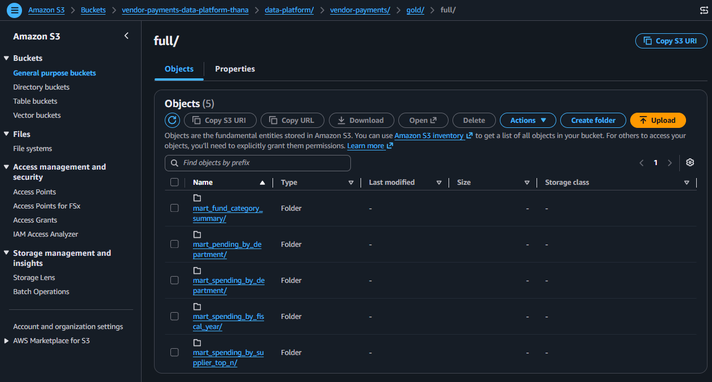

### Streaming Zones

```text
data-platform/vendor-payments/streaming/
│
├── staging/
│   └── vendor_payments_streaming_staging.jsonl
│
├── curated/
│   └── vendor_payments_streaming_events.csv
│
└── reports/
```

The curated Streaming CSV contains the validated event dataset used by Athena and Redshift.

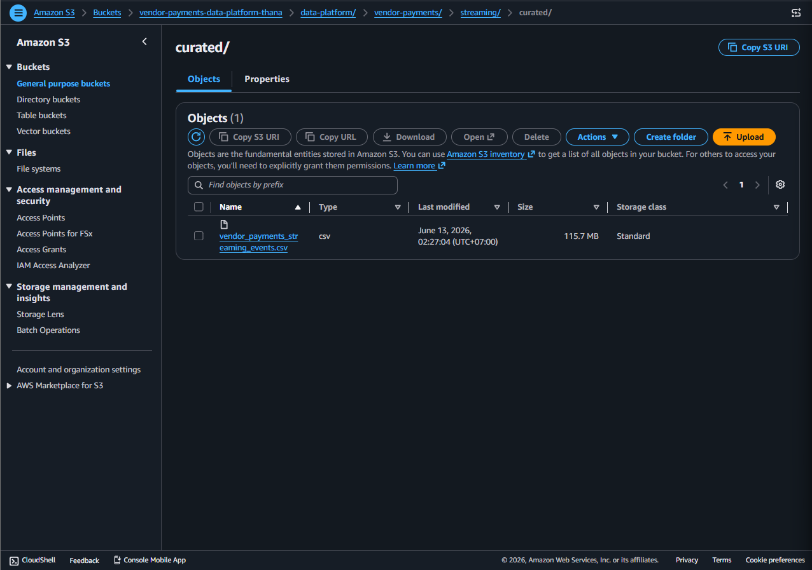

Generated data files remain outside Git and are published directly to Amazon S3.

---

## 🔎 Amazon Athena and AWS Glue Data Catalog

Amazon Athena provides a serverless SQL query layer over the S3 data lake.

The SQL definitions are stored under:

```text
sql/athena/
```

The repository includes SQL for:

* Creating the analytics database
* Creating Batch Gold external tables
* Creating the Streaming external table
* Querying fiscal-year spending
* Querying top suppliers
* Querying pending payments by department
* Querying Streaming events and aggregations

Athena enables direct analysis of trusted S3 outputs without requiring data movement into a dedicated warehouse.

AWS Glue Data Catalog stores the external table metadata used by Athena.

```text
Amazon S3 objects
→ AWS Glue table metadata
→ Amazon Athena SQL queries
```

---

## 🏢 Amazon Redshift Serverless

Amazon Redshift Serverless provides the warehouse serving layer.

The warehouse is separated into two schemas:

```text
landing
analytics
```

### Landing Schema

The `landing` schema stores validated Batch and Streaming datasets loaded from Amazon S3.

```text
landing.fund_category_summary
landing.pending_by_department
landing.spending_by_department
landing.spending_by_fiscal_year
landing.spending_by_supplier_top_n
landing.vendor_payments_streaming_events
```

### Analytics Schema

The `analytics` schema exposes warehouse-ready views for downstream analysis.

```text
Batch analytics views = 5
Streaming analytics views = 4
Total analytics views = 9
```

The SQL implementation is stored under:

```text
sql/redshift/
```

---

## 📦 Batch Warehouse Layer

The Batch warehouse flow loads five Gold marts from Amazon S3 into Redshift landing tables.

```text
S3 Gold marts
→ Redshift COPY
→ landing schema
→ analytics views
→ business analytics
```

### Batch Landing Tables

The five landing tables were created successfully.

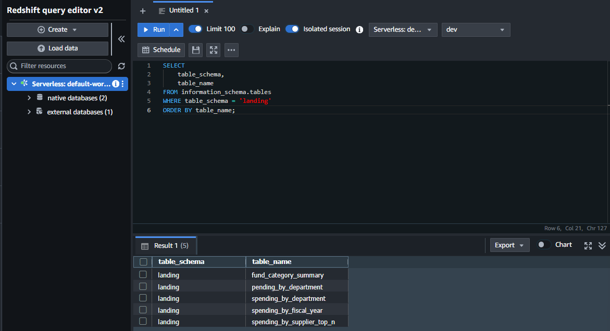

### Batch Landing Row Counts

Validated Batch landing rows:

| Table                        |      Rows |
| ---------------------------- | --------: |
| `fund_category_summary`      |     1,061 |
| `pending_by_department`      |       642 |
| `spending_by_department`     |     1,121 |
| `spending_by_fiscal_year`    |        20 |
| `spending_by_supplier_top_n` |       100 |
| **Total**                    | **2,944** |

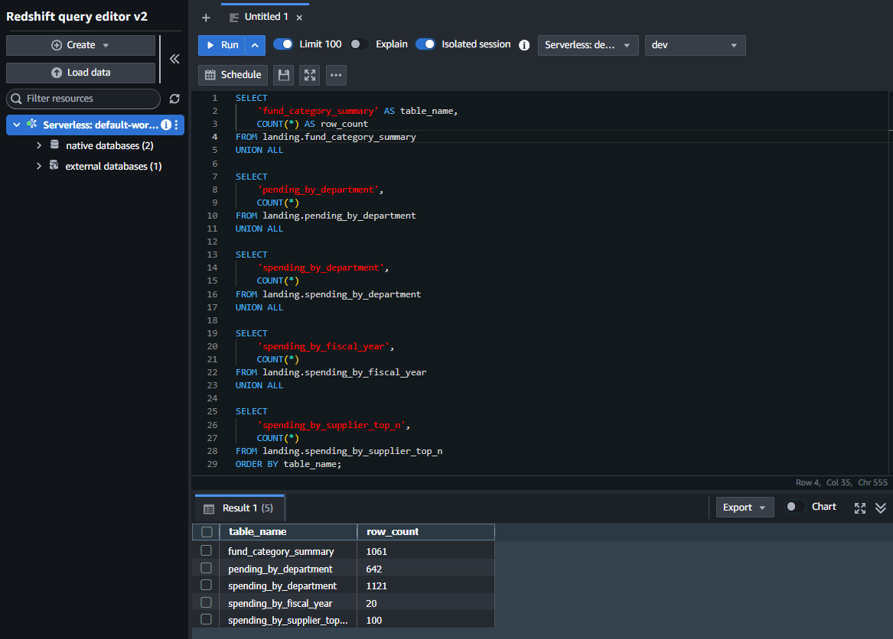

### Batch Analytics Views

Five Batch analytics views provide fiscal-year, department, supplier, fund-category, and pending-payment analysis.

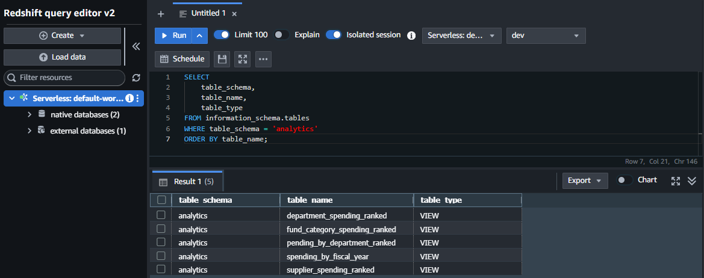

### Year-over-Year Analytics

The fiscal-year analytics view calculates previous-year values and year-over-year changes directly in the warehouse.

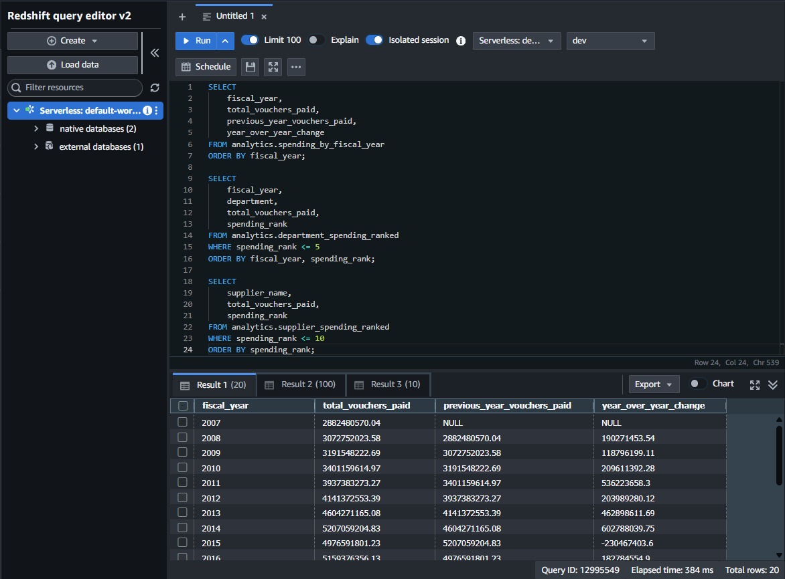

---

## 🌊 Streaming Warehouse Layer

The Streaming warehouse flow loads the curated event dataset from Amazon S3 into Redshift.

```text
Validated Streaming events
→ Curated CSV
→ Amazon S3
→ Redshift landing table
→ Streaming analytics views
```

### Streaming Landing Validation

The landing table contains:

```text
total_rows          = 100000
rows_with_event_id  = 100000
distinct_event_ids  = 100000
duplicate_event_ids = 0
missing_event_ids   = 0
```

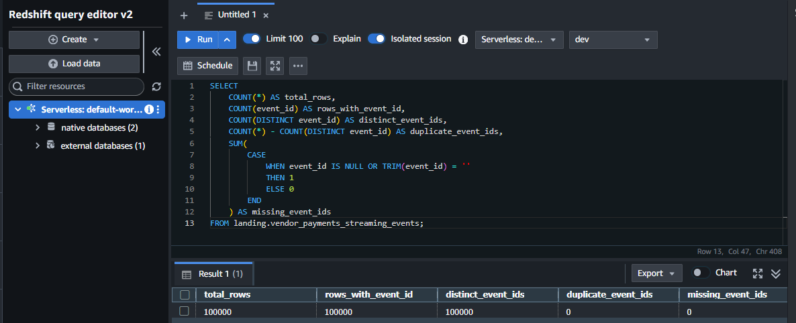

This validates that all accepted Streaming records retain a valid and unique `event_id` after cloud publishing and warehouse loading.

### Batch and Streaming Analytics Views

The `analytics` schema contains both Batch and Streaming views.

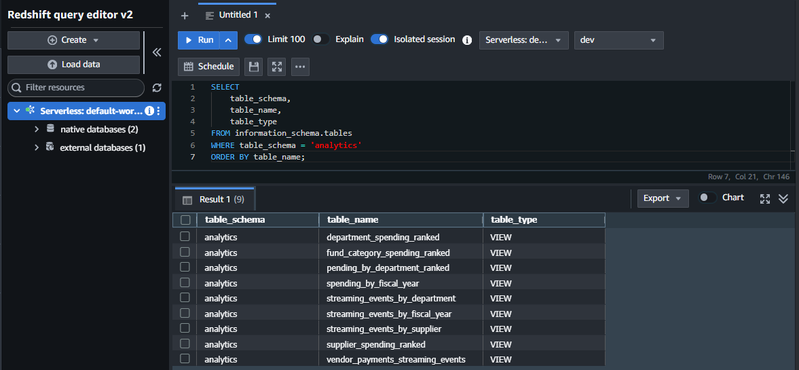

### Streaming Analytics Validation

The fiscal-year Streaming view validates that warehouse analytics totals match the landing dataset.

```text
fiscal_year_rows      = 20
total_events          = 100000
total_distinct_events = 100000
```

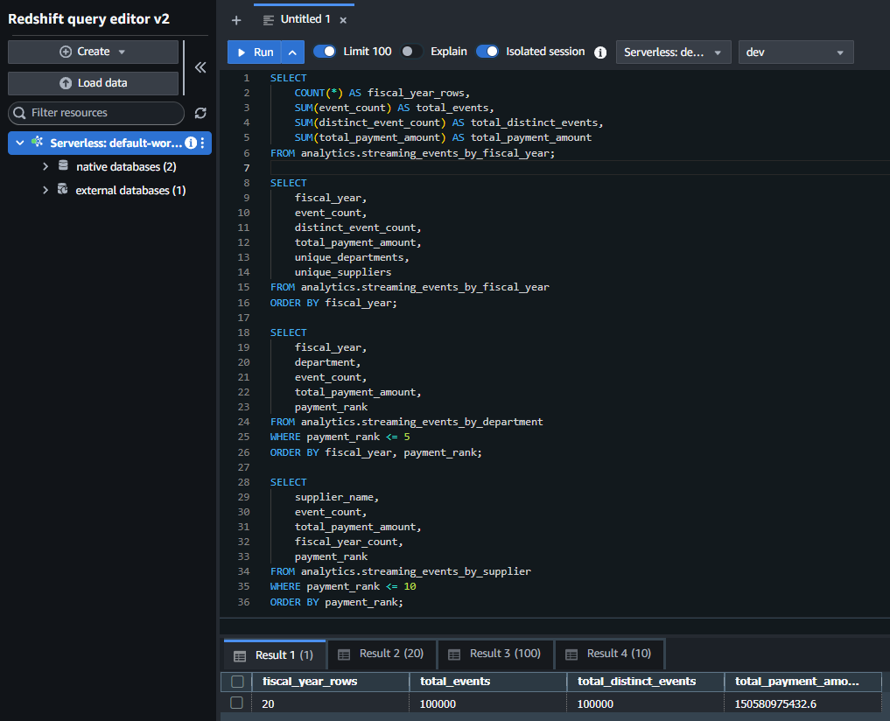

---

## 🧾 Runtime Metadata

The Redshift metadata generator queries the existing warehouse through the Redshift Data API.

Generator:

```text
scripts/warehouse/generate_redshift_summary.py
```

Generated artifact:

```text
output/reports/redshift_execution_summary.json
```

The execution summary records:

```text
Project identity
Platform component
Pipeline version
Generation timestamp
Execution start and completion timestamps
Runtime
Execution status
AWS region
Redshift workgroup
Database
Landing and analytics schemas
Batch landing and analytics metrics
Streaming landing and analytics metrics
Event-ID validation metrics
Overall validation status
Generated artifact path
```

Example top-level structure:

```json
{
  "project": "Vendor Payments Cloud Data Platform",
  "component": "Amazon Redshift Serverless",
  "pipeline_version": "1.0.0",
  "generated_at": "2026-06-22T17:11:10.872788+00:00",
  "execution": {
    "started_at": "2026-06-22T17:07:45.925482+00:00",
    "completed_at": "2026-06-22T17:11:10.872788+00:00",
    "runtime_seconds": 188.58,
    "status": "PASS"
  },
  "redshift": {},
  "batch": {},
  "streaming": {},
  "validation": {
    "status": "PASS"
  },
  "artifact": {
    "path": "output/reports/redshift_execution_summary.json",
    "format": "json"
  }
}
```

The generator validates the required metadata contract before writing the JSON artifact.

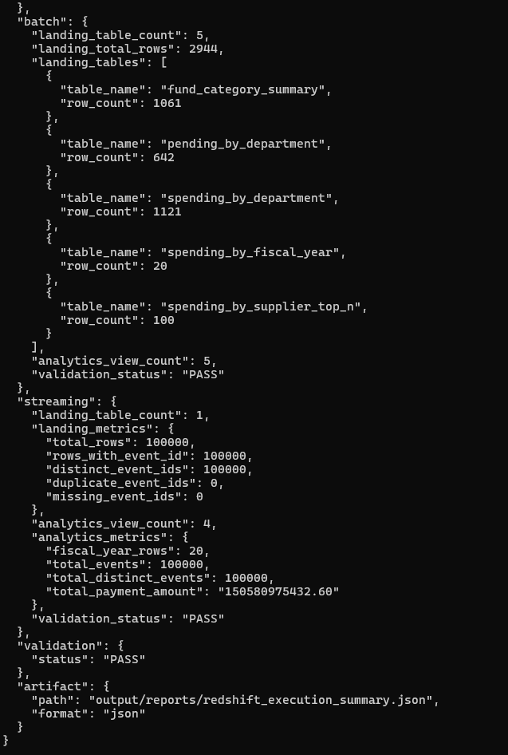

---

## ✅ Validation

Run the complete test suite:

```powershell
pytest
```

Run Ruff:

```powershell
ruff check .
```

Current local result:

```text
34 passed
All checks passed!
```

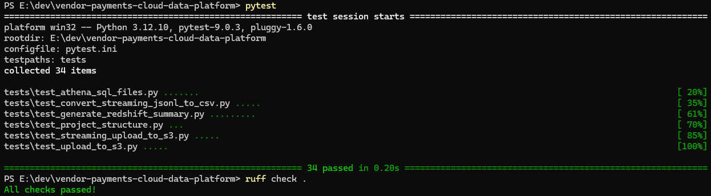

### Test Coverage

The automated tests validate:

* Required project directories and files
* Final architecture and execution-evidence assets
* Batch S3 upload plans
* Streaming S3 upload plans
* Local input validation before upload
* S3 key and zone structure
* Streaming JSONL parsing
* Nested event-record flattening
* JSONL-to-CSV conversion
* Athena SQL file availability
* Batch Athena definitions
* Streaming Athena definitions
* Batch warehouse metric validation
* Streaming event-ID validation
* Required metadata sections
* Missing metadata handling
* Invalid execution status handling
* Invalid validation status handling
* JSON-compatible value normalization

The unit tests do not require active AWS credentials or a live Redshift connection.

---

## ⚙️ Continuous Integration

GitHub Actions runs automatically on pushes and pull requests to `main`.

```text
Ruff
→ Pytest
```

Workflow:

```text
.github/workflows/ci.yml
```

The CI workflow validates Python code, SQL assets, metadata contracts, project structure, and automated tests.

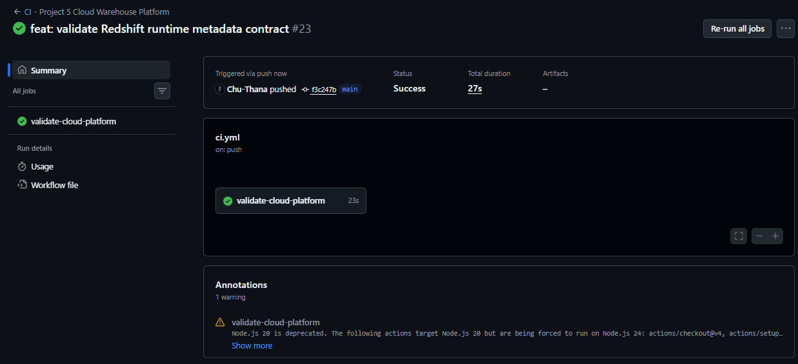

Current CI result:

```text
validate-cloud-platform: Success
Job duration: 23 seconds
Workflow total duration: 27 seconds
```

AWS credentials are not required because CI validates code and contracts without executing cloud write operations.

---

## 📸 Execution Evidence

The repository includes verified execution evidence for:

- Amazon S3 Batch and Streaming objects
- Redshift Batch landing tables and analytics views
- Streaming event-ID validation
- Runtime metadata generation
- Local Pytest and Ruff validation
- GitHub Actions CI

Evidence is presented in the relevant sections above to avoid duplicating screenshots.

---

## 🗂️ Project Structure

```text
vendor-payments-cloud-data-platform/
│
├── .github/
│   └── workflows/
│       └── ci.yml
│
├── assets/
│   ├── legacy/
│   │   └── vendor-payments-cloud/
│   │       ├── batch/
│   │       └── streaming/
│   │
│   └── redshift/
│       ├── 00_cloud_data_platform_architecture.png
│       ├── 01_s3_full_gold_marts.png
│       ├── 02_redshift_batch_landing_tables_created.png
│       ├── 03_redshift_batch_landing_row_counts.png
│       ├── 04_redshift_batch_analytics_views.png
│       ├── 05_redshift_year_over_year_analytics.png
│       ├── 06_s3_streaming_curated_csv.png
│       ├── 07_redshift_streaming_landing_validation.png
│       ├── 08_redshift_batch_streaming_analytics_views.png
│       ├── 09_redshift_streaming_analytics_validation.png
│       ├── 10_redshift_runtime_metadata_generated.png
│       ├── 11_project5_automated_tests_passed.png
│       └── 12_project5_github_actions_ci_passed.png
│
├── scripts/
│   ├── batch/
│   │   ├── convert_to_parquet.py
│   │   ├── upload_csv_to_s3.py
│   │   ├── upload_full_gold_to_s3.py
│   │   └── upload_to_s3.py
│   │
│   ├── streaming/
│   │   ├── convert_streaming_jsonl_to_csv.py
│   │   └── upload_streaming_to_s3.py
│   │
│   └── warehouse/
│       └── generate_redshift_summary.py
│
├── sql/
│   ├── athena/
│   │   ├── 01_create_database.sql
│   │   ├── 02_create_gold_tables.sql
│   │   ├── 03_query_spending_by_fiscal_year.sql
│   │   ├── 04_query_top_suppliers.sql
│   │   ├── 05_query_pending_by_department.sql
│   │   ├── 06_create_streaming_events_table.sql
│   │   └── 07_query_streaming_events.sql
│   │
│   └── redshift/
│       ├── 01_create_schemas.sql
│       ├── 02_create_batch_landing_tables.sql
│       ├── 03_copy_batch_gold_from_s3.sql
│       ├── 04_create_batch_analytics_views.sql
│       ├── 05_validate_batch_analytics.sql
│       ├── 06_create_streaming_landing_table.sql
│       ├── 07_copy_streaming_curated_from_s3.sql
│       ├── 08_create_streaming_analytics_views.sql
│       └── 09_validate_streaming_analytics.sql
│
├── output/
│   └── reports/
│       └── redshift_execution_summary.json
│
├── tests/
│   ├── test_athena_sql_files.py
│   ├── test_convert_streaming_jsonl_to_csv.py
│   ├── test_generate_redshift_summary.py
│   ├── test_project_structure.py
│   ├── test_streaming_upload_to_s3.py
│   └── test_upload_to_s3.py
│
├── .env.example
├── .gitignore
├── pytest.ini
├── requirements.txt
└── README.md
```

---

## ▶️ Run Locally

Create and activate a virtual environment:

```powershell
python -m venv .venv
.venv\Scripts\Activate.ps1
```

Install dependencies:

```powershell
pip install -r requirements.txt
```

Run tests and Ruff:

```powershell
pytest
ruff check .
```

### Upload Batch Outputs

```powershell
python -m scripts.batch.upload_to_s3
```

### Convert Streaming JSONL to CSV

```powershell
python -m scripts.streaming.convert_streaming_jsonl_to_csv
```

### Upload Streaming Outputs

```powershell
python -m scripts.streaming.upload_streaming_to_s3
```

### Generate Redshift Runtime Metadata

```powershell
python scripts\warehouse\generate_redshift_summary.py
```

The Redshift metadata generator requires access to the configured AWS account and Redshift Serverless workgroup.

---

## 🔧 Environment Configuration

AWS credentials are resolved through the standard AWS credential chain.

Example:

```env
AWS_PROFILE=default
AWS_REGION=ap-southeast-1

S3_BUCKET=your-s3-bucket-name
S3_PREFIX=data-platform/vendor-payments

REDSHIFT_WORKGROUP=default-workgroup
REDSHIFT_DATABASE=dev

PROJECT1_ROOT=E:\dev\vendor-payments-etl-analytics
PROJECT3_ROOT=E:\dev\vendor-payments-streaming-pipeline
PROJECT4_OUTPUT_ROOT=E:\dev\vendor-payments-airflow-orchestration\output
```

Do not commit real credentials, access keys, secrets, or account-specific configuration.

---

## 💰 AWS Cost and Resource Management

The project uses serverless and object-storage services, but active resources may still create AWS charges.

Cost-sensitive resources include:

* Amazon S3 object storage
* Athena query data scanned
* Redshift Serverless compute usage
* Redshift managed storage
* AWS Glue Data Catalog usage beyond applicable free quotas
* Data transfer where applicable

Recommended controls:

* Stop or remove resources that are no longer required
* Keep only necessary S3 evidence and curated datasets
* Limit Athena scans through partitioning and targeted queries
* Review Redshift Serverless usage and capacity settings
* Configure AWS Budgets and billing alerts
* Remove test resources after validation

The repository does not provision infrastructure automatically. Cloud resources are created and managed separately.

---

## 🔗 Role in the Vendor Payments Data Platform

```text
Batch ETL Pipeline
→ produces validated Silver and Gold analytics outputs

Kafka Streaming Pipeline
→ produces validated and deduplicated event data

Airflow Orchestration
→ invokes processing scripts, coordinates execution,
  and validates runtime metadata

Cloud Data Platform
→ owns S3, Athena, Glue Catalog, Redshift,
  analytics views, and warehouse runtime metadata

API Serving Layer
→ exposes trusted Batch and Streaming analytics

Power BI and Web Analytics
→ consume business and event insights
```

This repository is the Cloud and Warehouse processing layer.

It does not own Batch transformation, Kafka ingestion, Airflow DAG implementation, API serving, or dashboard presentation logic.

---

## 🧠 Key Engineering Decisions

* Keep Cloud and Warehouse processing separate from orchestration logic
* Use S3 as durable storage for Batch and Streaming outputs
* Separate Batch and Streaming S3 zones
* Use Athena for serverless SQL access over S3
* Use Redshift Serverless for warehouse-optimized analytics
* Separate landing tables from analytics views
* Load trusted datasets from S3 instead of embedding source data in the repository
* Validate event-ID uniqueness at the warehouse layer
* Validate relationships between landing and analytics totals
* Generate durable runtime metadata as JSON
* Enforce a required metadata contract before writing the artifact
* Use IAM and the Redshift Data API instead of stored database credentials
* Keep generated datasets and local runtime files out of Git
* Validate code, SQL assets, project structure, and metadata logic in CI

---

## 🛣️ Planned Development

* Add infrastructure-as-code for repeatable AWS deployment
* Add partition-aware Athena optimization
* Add automated Redshift loading orchestration
* Add centralized observability and cloud cost reporting
* Add Power BI semantic models and dashboards
* Add Web Analytics Application integration
* Add alerting for failed Cloud and Warehouse executions

---

## 🎯 Key Takeaway

This project demonstrates more than uploading files to Amazon S3.

It shows how to extend trusted Batch and Streaming outputs into a cloud analytics platform with:

```text
Layered S3 storage
→ Serverless Athena queries
→ Redshift landing tables
→ Analytics views
→ Runtime metadata
→ Automated validation
→ Portfolio-ready execution evidence
```

The result is a modular Cloud and Warehouse layer with clear responsibility boundaries, measurable validation, and reusable analytics outputs for APIs, dashboards, and web applications.
