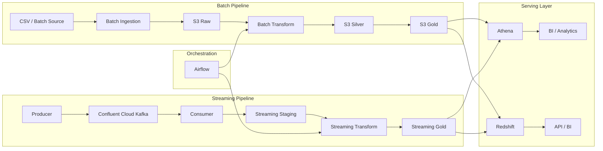
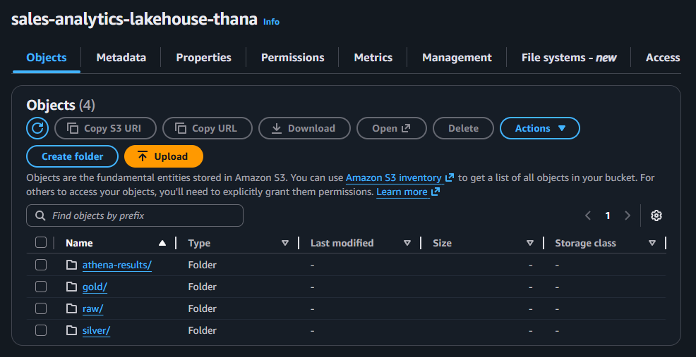
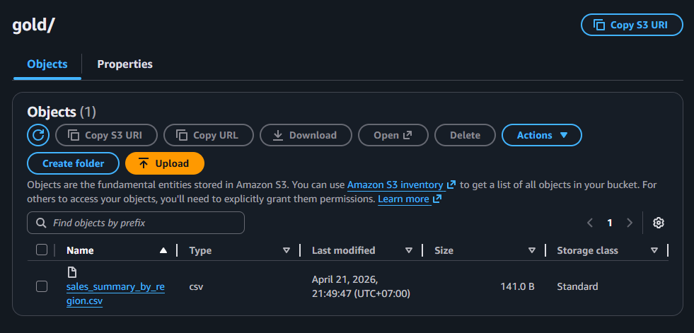
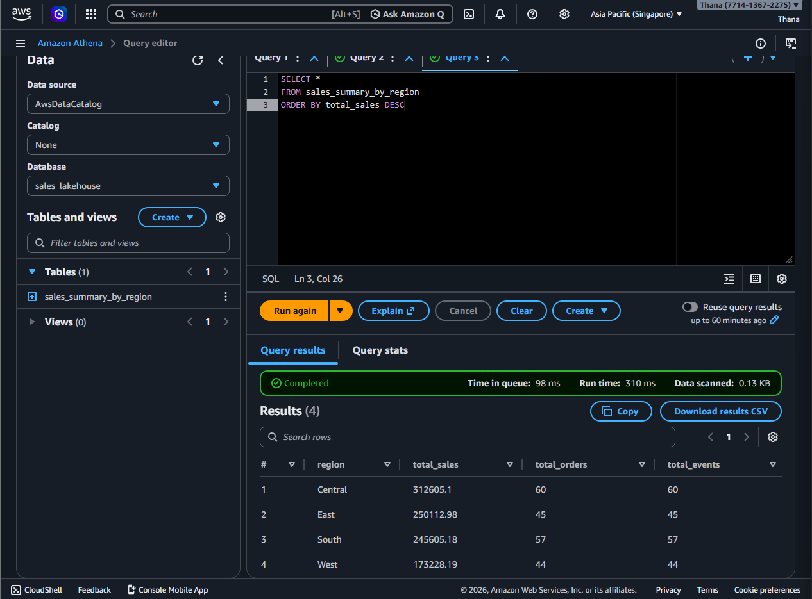
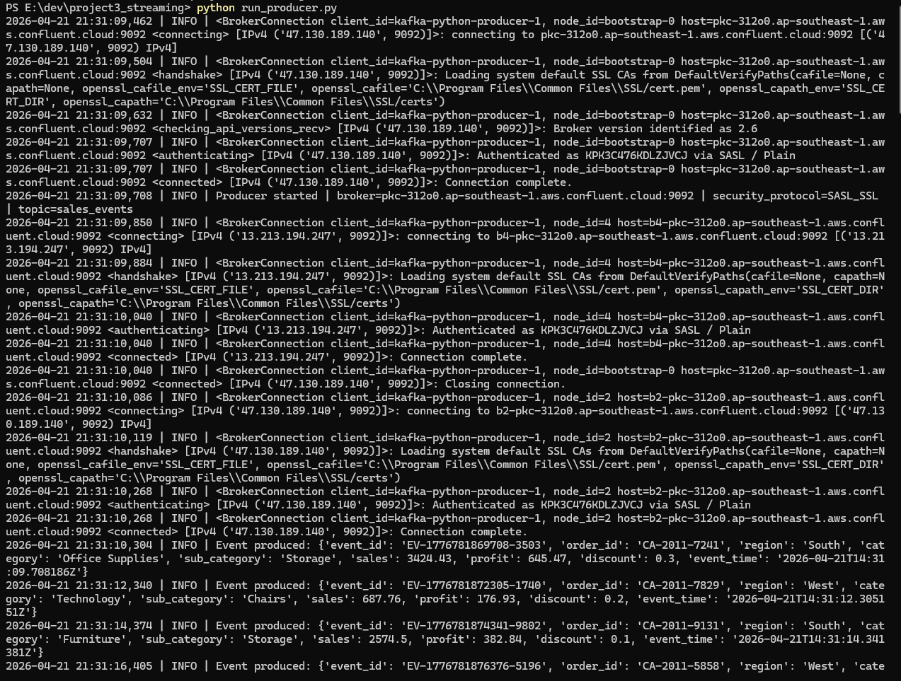

# ☁️ Cloud Data Platform

---

## 📌 Summary

This project implements a modern cloud data platform on AWS that supports both:

- Batch Pipeline (scheduled ingestion & transformation)
- Streaming Pipeline (real-time event processing)

The system is designed to simulate a production-grade data architecture:

- Unified S3 Data Lake with raw / silver / gold layers
- Kafka (Confluent Cloud) for real-time ingestion
- Airflow orchestration for both batch and streaming workflows
- Dual serving layer using Athena (serverless query) and Redshift (data warehouse)

👉 This is not just a pipeline — it is a complete data platform design.

---

## 🏗 Architecture Overview

> Two pipelines — **batch** and **streaming** — converge into a unified gold layer and are served through Athena.

---

## ⚙️ Design Principles

- Separate **batch vs streaming ingestion**
- Use **S3 as the central data lake**
- Apply **layered architecture**: raw → silver → gold
- Support **at-least-once streaming** with downstream deduplication
- Centralize orchestration through **Airflow**
- Provide serverless analytics through **Athena**

---

## 🔄 End-to-End Flow

### 🟦 Batch Pipeline

1. Load raw CSV data  
2. Store data in S3 raw layer  
3. Airflow orchestrates transformation workflows  
4. Write cleaned data to S3 silver layer  
5. Aggregate data into S3 gold layer  
6. Query via Athena or load into Redshift for analytics  

### 🟨 Streaming Pipeline

1. Producer generates real-time sales events  
2. Events are sent to Kafka (Confluent Cloud)  
3. Consumer processes events and writes staging data  
4. Airflow orchestrates transformation and deduplication  
5. Aggregated output is written to S3 gold layer  
6. Data is served via Athena or Redshift for analytics / BI  

---

## 📸 Pipeline Walkthrough

### 1️⃣ S3 Data Lake Structure

> Data is organized into **raw / silver / gold layers**, following data lake best practices.

---

### 2️⃣ S3 Gold Output

> Final curated data is stored in the gold layer and ready for analytics.

---

### 3️⃣ Athena Query Result

> Athena is used as a serverless query engine to analyze gold-layer data.

---

### 4️⃣ Kafka Cloud Topics

> Kafka on Confluent Cloud handles real-time event ingestion with partitioned topics.

---

### 5️⃣ Kafka Producer Running

> Producer continuously generates and streams events into Kafka.

---

## ⚡ Scalability Design

- Kafka partitions enable horizontal scaling of consumers for parallel event processing
- Airflow orchestrates pipelines as modular, independently scalable tasks
- S3 decouples storage from compute, allowing unlimited data growth
- Athena enables serverless, on-demand querying without infrastructure management
- The serving layer supports both ad-hoc analytics (Athena) and scalable warehouse workloads (Redshift)

---

## 🚨 Reliability & Data Quality

- Kafka is configured with **at-least-once delivery** to guarantee no data loss
- Trade-off: duplicates are allowed and handled downstream
- Deduplication is performed in the processing layer (Airflow / transformation step)
- Airflow provides retry mechanisms for fault tolerance and pipeline recovery
- Raw → Silver → Gold layers ensure traceability and reproducibility
- Gold layer datasets can be rebuilt deterministically from upstream data

👉 This design prioritizes **data integrity over duplication**, following real-world data engineering practices.

---

## 🧠 What This Project Demonstrates

This project showcases the design and implementation of a **production-style cloud data platform**, integrating both batch and real-time processing:

- End-to-end cloud data architecture on AWS
- Unified batch + streaming pipeline design
- Kafka migration to Confluent Cloud for real-time ingestion
- Airflow orchestration for reliable data workflows
- S3-based data lake with raw / silver / gold layering
- Serverless analytics using Athena
- Integration-ready serving layer for BI and downstream systems

👉 More importantly, it reflects **system-level thinking beyond individual tools**.

---

## 💡 Key Takeaway

This project demonstrates how to design a **real-world data platform**, not just isolated pipelines:

- Batch pipelines handle scheduled, structured data processing
- Streaming pipelines enable real-time event ingestion and processing
- Airflow ensures orchestration, retries, and workflow reliability
- S3 acts as a scalable and unified data lake (single source of truth)
- Athena and Redshift enable flexible and performant data serving

👉 The architecture balances **scalability, reliability, and data integrity**, following real-world data engineering principles.

👉 This is not just a pipeline — it is a **complete, production-inspired data platform**.
