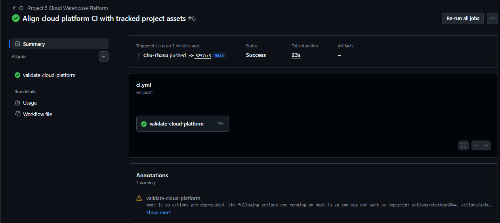
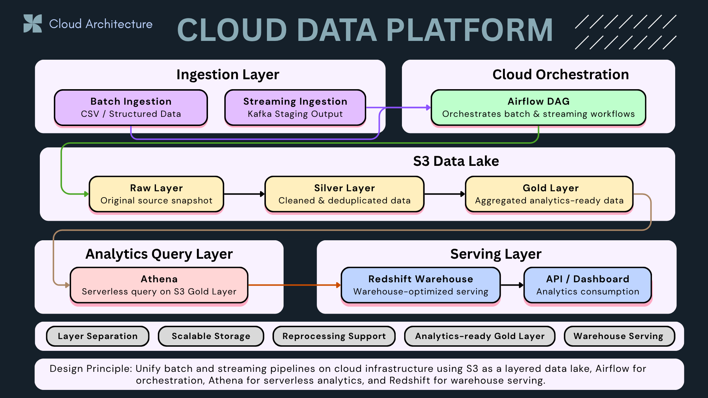

# ☁️ Cloud Data Platform (AWS Data Lakehouse)

---

## 📌 Summary

Designed and implemented a **cloud-based data platform on AWS** supporting batch and streaming workloads with a unified data lake architecture.

* Built S3 data lake with **raw / silver / gold layers**
* Enabled analytics via **Athena (serverless)** and **Redshift (data warehouse)**
* Orchestrated pipelines using **Airflow**
* Designed system for **scalability, performance, and data reliability**

👉 This is a **production-style data platform**, not just a pipeline.

---

## ⚙️ CI Validation

This project includes a GitHub Actions CI workflow that runs automatically on every push to the `main` branch.

The CI pipeline validates:

- Code quality with Ruff
- Project structure for cloud platform components
- Required architecture assets and documentation evidence
- Batch scripts used for S3 data lake preparation

👉 This helps ensure that the cloud warehouse platform remains maintainable, organized, and ready for further cloud deployment or orchestration work.

---

## 🧭 Architecture Overview

This project demonstrates a **cloud data platform architecture** that unifies batch and streaming pipelines using AWS cloud services.

The platform uses **S3 as a layered data lake**, **Airflow for orchestration**, **Athena for serverless analytics**, and **Redshift for warehouse serving and downstream consumption**.

**Design principle:** Unify batch and streaming pipelines on cloud infrastructure using S3 as a layered data lake, Airflow for orchestration, Athena for serverless analytics, and Redshift for warehouse serving.

### Key Components

- **Batch Ingestion:** Loads CSV and structured data into the platform
- **Streaming Ingestion:** Receives Kafka staging output for downstream processing
- **Airflow DAG:** Orchestrates batch and streaming workflows
- **S3 Data Lake:** Stores data across Raw, Silver, and Gold layers
- **Athena:** Queries analytics-ready data directly from the S3 Gold Layer
- **Redshift Warehouse:** Serves warehouse-optimized data for API and dashboard consumption

👉 **This architecture separates storage, orchestration, analytics querying, and warehouse serving into clear layers.**

---

## 📊 Cloud Metrics (Performance & Scale)

* Built data lake with **3 layers (raw / silver / gold)** on S3
* Managed **4 schemas** in Redshift (raw, staging, mart, serving)
* Created **analytical mart table for aggregation queries**

### ⚡ Query Performance

* Athena query execution: **~0.31 sec**
* Redshift query execution: **~0.47 sec**

### 📦 Data Volume

* Total data processed in S3: **~477 KB**

👉 Metrics collected from real query executions and pipeline outputs

---

## 📸 Pipeline Evidence

### 1️⃣ S3 Data Lake Structure

> Organized into raw / silver / gold layers following data lake best practices

---

### 2️⃣ Athena Query Performance

> Serverless analytics with sub-second query performance

---

### 3️⃣ Redshift Query Performance

> Warehouse-based aggregation for structured analytics workloads

---

## ⚙️ Key Design Principles

* **Layered architecture**: raw → silver → gold
* **Separation of storage and compute** (S3 + Athena / Redshift)
* **Serverless-first analytics design**
* **Orchestrated pipelines via Airflow**
* **Reproducible data transformations**

---

## ⚡ Scalability & Performance

* S3 provides **unlimited scalable storage**
* Athena enables **on-demand serverless queries**
* Redshift supports **high-performance analytical workloads**
* Airflow enables **modular pipeline orchestration**

---

## 🚨 Reliability & Data Quality

* Structured data flow ensures traceability across layers
* Data transformations are reproducible and deterministic
* Airflow enables retries and pipeline recovery
* Gold layer serves as **single source of truth for analytics**

---

## 🧠 What This Project Demonstrates

* End-to-end **cloud data architecture on AWS**
* Data lake design with **multi-layer processing**
* Integration of **Athena + Redshift for dual analytics workloads**
* Orchestration using Airflow
* Real-world focus on **performance, scalability, and system design**

---

## 💡 Key Takeaway

This project demonstrates how to build a **modern cloud data platform**:

* Scalable storage (S3)
* Serverless analytics (Athena)
* Warehouse optimization (Redshift)
* Reliable orchestration (Airflow)

👉 Focused on **real-world system design**, not just tools
