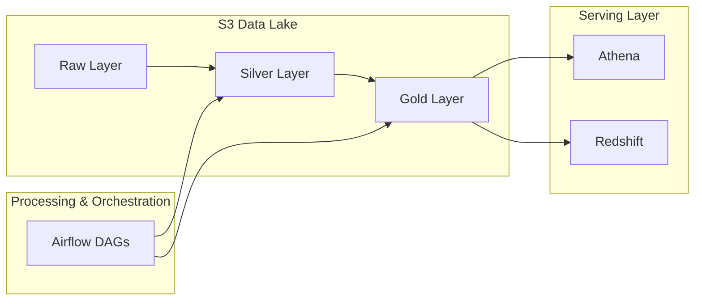
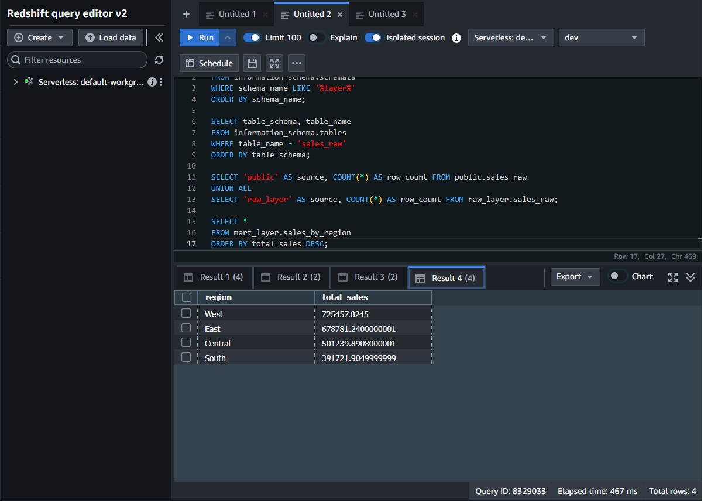

# ☁️ Cloud Data Platform (AWS Data Lakehouse)

---

## 📌 Summary

Designed and implemented a **cloud-based data platform on AWS** supporting batch and streaming workloads with a unified data lake architecture.

* Built S3 data lake with **raw / silver / gold layers**
* Enabled analytics via **Athena (serverless)** and **Redshift (data warehouse)**
* Orchestrated pipelines using **Airflow**
* Designed system for **scalability, performance, and data reliability**

👉 This is a **production-style data platform**, not just a pipeline.

---

## 🏗 Architecture Overview

---

## 📊 Cloud Metrics (Performance & Scale)

* Built data lake with **3 layers (raw / silver / gold)** on S3
* Managed **4 schemas** in Redshift (raw, staging, mart, serving)
* Created **analytical mart table for aggregation queries**

### ⚡ Query Performance

* Athena query execution: **~0.31 sec**
* Redshift query execution: **~0.47 sec**

### 📦 Data Volume

* Total data processed in S3: **~477 KB**

👉 Metrics collected from real query executions and pipeline outputs

---

## 📸 Pipeline Evidence

### 1️⃣ S3 Data Lake Structure

> Organized into raw / silver / gold layers following data lake best practices

---

### 2️⃣ Athena Query Performance

> Serverless analytics with sub-second query performance

---

### 3️⃣ Redshift Query Performance

> Warehouse-based aggregation for structured analytics workloads

---

## ⚙️ Key Design Principles

* **Layered architecture**: raw → silver → gold
* **Separation of storage and compute** (S3 + Athena / Redshift)
* **Serverless-first analytics design**
* **Orchestrated pipelines via Airflow**
* **Reproducible data transformations**

---

## ⚡ Scalability & Performance

* S3 provides **unlimited scalable storage**
* Athena enables **on-demand serverless queries**
* Redshift supports **high-performance analytical workloads**
* Airflow enables **modular pipeline orchestration**

---

## 🚨 Reliability & Data Quality

* Structured data flow ensures traceability across layers
* Data transformations are reproducible and deterministic
* Airflow enables retries and pipeline recovery
* Gold layer serves as **single source of truth for analytics**

---

## 🧠 What This Project Demonstrates

* End-to-end **cloud data architecture on AWS**
* Data lake design with **multi-layer processing**
* Integration of **Athena + Redshift for dual analytics workloads**
* Orchestration using Airflow
* Real-world focus on **performance, scalability, and system design**

---

## 💡 Key Takeaway

This project demonstrates how to build a **modern cloud data platform**:

* Scalable storage (S3)
* Serverless analytics (Athena)
* Warehouse optimization (Redshift)
* Reliable orchestration (Airflow)

👉 Focused on **real-world system design**, not just tools
